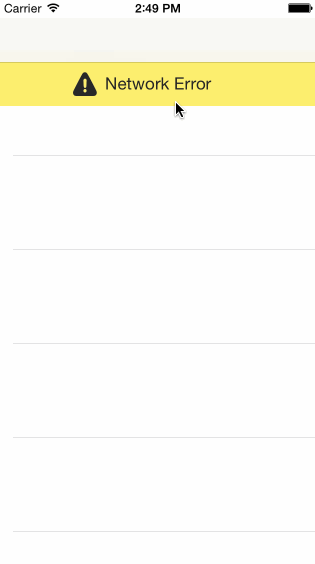

#### How many hours did it take to complete?

About 10 hours

#### Stories

- [x] The user can view a list of movies from Rotten Tomatoes
- [x] Movie posters load asynchronously
- [x] The user can view movie details by clicking on a movie in the list
- [x] The user will see a loading state while querying the movies API
- [x] A network error banner is displayed when there is no internet connection
- [x] The movie list can be pulled down to refresh
- [x] The movie detail view displays a low resolution image while loading
- [x] The application makes uses of [CocoaPods][1]

#### GIF Walkthrough

#### Open source software used:

* [Cocoa Pods][1]
* [AFNetworking][2]
* [MBProgressHUD][3]
* [The Noun Project][4]
* [Warning Icon][5] by [Lorena Salagre][6]

#### License

[MIT](License)

[1]: http://cocoapods.org/
[2]: http://afnetworking.com/
[3]: https://github.com/matej/MBProgressHUD
[4]: http://thenounproject.com/
[5]: http://thenounproject.com/term/warning/32255/
[6]: http://thenounproject.com/lorens/
